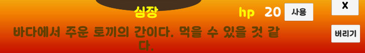

개발 기간 : 2025.08.25(월) ~ 2025.08.28(목)
목표 : 인벤토리 구현

JSON을 사용하여 아이템 리스트를 만들고, 이를 인벤토리에 넣어주는 식으로 진행해보려 했지만, 많은 어려움으로 인해 실패.

결국 ScriptableObject를 사용하여 다른 방식으로 구현 성공.

UI의 정해진 틀이 없었고, 개인 프로젝트라 하고 싶은 대로 자유롭게 만듦.

1. 기본 화면

2. 인벤토리
- 현재 인벤토리에 들어있는 개수 만큼 인벤토리 글자 옆 숫자가 변경됨
- 아이템을 사용하거나 버릴 시 인벤토리창에서 사라짐.
- 인벤토리는 스크롤로 내리거나 올릴 수 있음.
- x 버튼을 누를 시 닫을 수 있음.

3. 아이템
- 아이템은 stack로 쌓아서 가질 수 없고, 각각의 아이템마다 1칸의 인벤토리를 차지함.
- 인벤토리 안의 아이템 클릭 시, 해당 아이템의 정보가 뜸.
- 인벤토리 밖의 아이템 클릭 시, 주워서 인벤토리에 담을 수 있음.
- 아이템은 자원/장비/소비 아이템으로 분류됨.
  - 자원 : 버리기 버튼만 존재
  - 소비 : 사용/버리기 버튼. 사용했을 시 hp 등이 회복됨.
  - 장비 : 장착/해제/버리기 버튼. 장착하거나 해제할 수 있음.

4. 상태창
- Player.cs에 들어있는 플레이어의 값을 가져와서 출력해 줌.
- 인벤토리에서 아이템을 사용했을 시 해당하는 스탯이 올라감.(ex : 하트 섭취 시 hp +20, 방어구 장착 시 방어력+9999)
- x 버튼을 누를 시 닫을 수 있음.

5. 기타 기능
- '천국의 계단' 버튼 클릭 시 플레이어가 하늘 위로 춤을 추면서 올라감.

